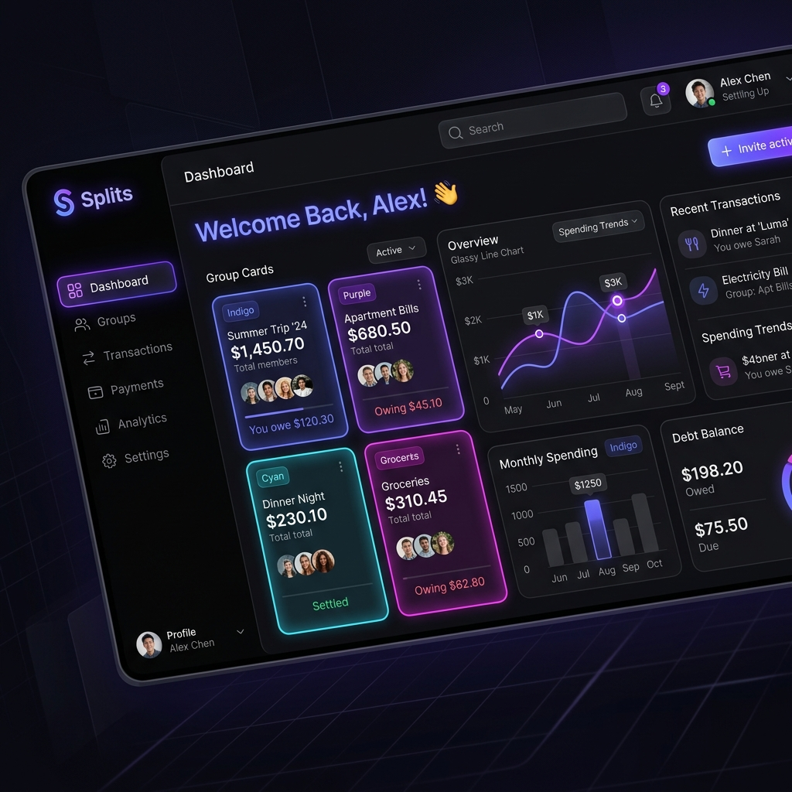

# 🏦 Splits Premium — Advanced Financial Intelligence Hub

[](https://react.dev/)
[](https://tailwindcss.com/)
[](https://vitejs.dev/)
[](https://socket.io/)



## 🌌 Overview

**Splits Premium** is a state-of-the-art, high-fidelity expense management ecosystem designed for modern collectives. Moving beyond simple bill splitting, it provides a **Command Deck** for financial telemetry, real-time cluster synchronization, and advanced settlement algorithms.

Built with a focus on **Premium Aesthetics**, **Quantum UI Principles**, and **Real-Time Responsiveness**, Splits Premium transforms mundane debt tracking into a sleek, gamified interface.

---

## 🛰️ Core Capabilities

### 💎 Quantum UI & Aesthetics
- **Glassmorphism Design**: Elegant translucent layers and vibrant gradients.
- **Micro-Animations**: Fluid transitions powered by **Framer Motion**.
- **Adaptive Theming**: Seamless switching between deep-space dark and surgical light modes.
- **Responsive HUD**: Fully optimized for mobile, tablet, and widescreen operational centers.

### ⚡ Real-Time Operational Layer
- **Live Signal Stream**: Instant updates across all devices via **Socket.io**.
- **Presence Tracking**: See who's active in your operational clusters in real-time.
- **Smart Push Registry**: Receive immediate alerts on expense logs and settlements.

### 📊 Financial Intelligence
- **Data Telemetry**: Interactive spending charts and category breakdowns using **Recharts**.
- **Cluster Matrix**: Advanced group management with recursive member resolution.
- **Automated Settlement**: Intelligent algorithms to minimize the number of transactions required.

---

## 🛠 Tech Stack (The Command Deck)

### **Frontend Infrastructure**
- **Framework**: React 19 (Ultra-fast concurrent rendering)
- **Styling**: Tailwind CSS 4 & PostCSS (High-performance utility styling)
- **Animations**: Framer Motion (60+ FPS cinematic transitions)
- **Icons**: Lucide React (Pixel-perfect tactical iconography)
- **Charts**: Recharts (Dynamic data visualization)
- **Routing**: React Router 7 (Seamless state-preserving navigation)

### **Intelligence Layer (Backend integration)**
- **Engine**: Node.js & Express
- **Persistence**: Hybrid MySQL (Relational) & MongoDB (Operational logs)
- **Real-Time**: Socket.io Uplink
- **Security**: JWT Identity Registry with encrypted payloads

---

## 🚀 Deployment Manual

### **1. Clone the Source**
```bash
git clone https://github.com/Nirmalkumar882000/Frontend_Split_App.git
cd Frontend_Split_App
```

### **2. Frontend Materialization**
Ensure you have **Node.js 18+** installed.
```bash
# Install dependencies
npm install

# Configure environment (Optional)
# cp .env.example .env

# Launch the Tactical HUD
npm run dev
```

### **3. Backend Uplink**
*Note: The backend repository must be running for full real-time capabilities.*
- Ensure the backend service is active on Port 5000.
- Verify MySQL and MongoDB clusters are operational.

---

## 👨‍💻 Architect

**Nirmal Kumar** - *Systems Architect & Full Stack Developer*
- 🌐 [Portfolio](https://tactical-portfolio-example.com)
- 🐙 [GitHub](https://github.com/Nirmalkumar882000)

---

> [!IMPORTANT]
> **Splits Premium** is currently in **Active Operational Mode**. Ensure all database clusters are properly synchronized before initiating heavy financial telemetry.

---
<p align="center">
  Built with ❤️ by Nirmal Kumar
</p>
